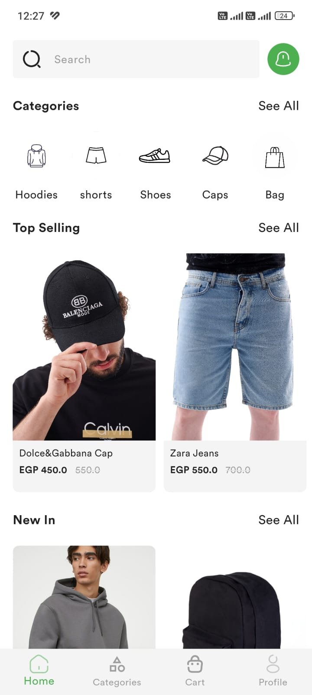
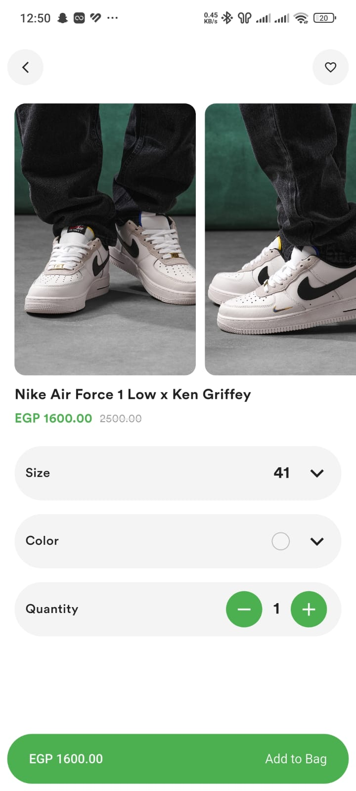

# locally

- A Flutter-based clothing store application with modern UI, product listing, cart, and order management.
  Built for practicing Clean Architecture, State Management (Bloc), and Firebase integration.

---

## Screenshots

  
  
  
  
  

---

## Features

- Browse clothing products

- Add to cart & manage orders

- Firebase Authentication (Sign up / Login)

- Cloud Firestore for storing products & orders

- Clean Architecture with Bloc & Cubit for state management

- Local storage with Shared Preferences

---

